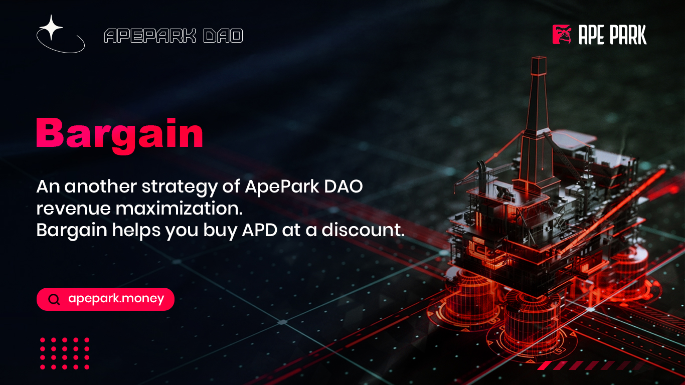

# 🛎 Bargain

## 什么**是Bargain？**

Bargain是ApeParkDAO收益最大化的第二策略。通过Bargain销售Bargain可以获得协议本身拥有的流动性及其他储备资产。协议向Bargain用户公告报价及条款，例如Bargain价格、有多少APD可以被Bargain用户所购买及授予期限。在授予期限到期前，Bargain用户可以先领取部分的奖励(APD代币)，待到期时可以全数领取。

Bargain是一个主动且可短期使用的策略。Bargain二级市场的价格发现机制(price discovery mechanism)使Bargain的折扣变得非常难以预测。因此购买Bargain被视为较为主动的投资策略，必须通过投资者持续的监视Bargain折扣才能获得相较于Unity更多的收益。

Bargain销售使ApeParkDAO可以累积协议本身拥有的流动性。我们称协议拥有流动性为POL。更多的POL可以确保永远有足够的资金锁于Cave，Cave被使用于交易池以促进市场运作及保护代币持有者。ApeParkDAO拥有自己的市场不仅给予了投资者额外的保障，同时协议从流动性提供者报酬(LP rewards)中积累更多的收入去支撑Cave。
