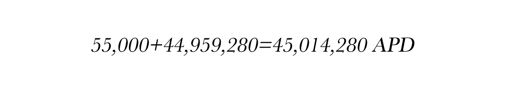
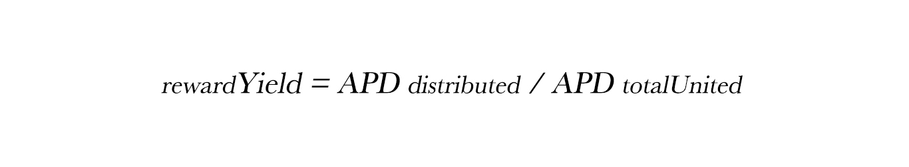

# 💡 常问问题

## 为什么**我们需要ApeParkDAO?**

1. Web3.0是传统游戏转型的归宿，我们作为技术服务平台与传统游戏转型的迫切需求相对应，双方利益绑定。
2. 由技术服务平台衍生的底层代币模型，融合了现实应用场景，具有强大的价值支撑。
3. 平台服务及投资收益与代币机制相结合，有效地为项目提供了内生驱动力。

## **APD 是稳定币吗？**

APD不是稳定币。APD作为ApeParkDAO的平台代币， 由综合抵押资产支持的储备货币 ，其专注于供应增长。APD价格牟定的是其资产篮子里的资产，与其他双代币模型（稳定币+治理代币）不同，APD充当了两种代币的角色，通过协议内部的增发回购，Bargain折扣机制，实现APD的价值稳定。

APD是由其他去中心化资产支持的，而不是挂钩的。每个APD由1USDT支持，而不是与之挂钩。由于Cave以至少1 USDT支持每个APD，因此该协议将在其交易低于1USDT时回购并销毁APD，具有将APD价格推回1USDT的效果。 APD始终可以在1USDT以上交易，因为协议没有上限。您可能会说APD的底价或内在价值是1USDT。我们认为实际的APD值永远是1USDT+溢价，但最终还是要由市场来决定。

## 它**是如何工作的？**

总的来说， APD由其协议管理的Cave、协议拥有流动性 (POL)、Bargain机制和Unity奖励控制供给关系。

Bargain销售为协议产生利润，Cave使用利润来铸造APD并将其分配给所有参与者。通过Bargain，协议能够积累自己的流动性。

## **为什么 PCV 很重要？**

由于协议控制其Cave中的资金，APD只能由协议铸造或销毁。这也保证了协议始终可以用1USDT支持1APD。您可以轻松鉴别您的投资风险，因为您可以相信本协议将用Cave中的资产购买低于1USDT的APD，直到没有人可以出售为止。

随着协议积累更多的PCV，可以为Unity不断延长时间。这意味着您可以相信Unity的APY能够维持更长时间，因为Cave中有更多的可用资金。

## 为**什么POL很重要？**

由于Bargain机制，APD拥有其大部分流动性。 这有几个好处：

APD不需要支付高额的挖矿奖励来激励流动性提供者，也就是租用流动性。

APD向市场保证流动性始终存在，以促进买卖交易。

作为最大的LP（流动性提供者），Cave赚取了大部分LP费用。

所有POL都可以用来支持APD。 为此，LP代币被标记为无风险价值。

## 如**果APD发生挤兑，会发生什么？**

银行准备金机制之所以有效，是因为储户不会一次全部提取资金。存款人对银行系统的信任取决于联邦存款保险公司 (FDIC) 等法规和机构。 APD没有FDIC的保障，但它有一个保护利益相关者的激励机制。让我们看看它在假设的挤兑期间的表现。在这种情况下，我们假设大多数Unity参与者会惊慌失措并从APD中收回他们的代币92%的Unity百分比现在迅速下降到3.3%，只剩下55,000个APD。接下来，我们假设流入Cave的无风险价值 (RFV) 完全枯竭。 就上下文而言，RFV目前以每2天约100万美元的速度增长。然而，在挤兑期间，这种增长可能会停止。

最后，我们假设最后的Unity参与者以每APD=500美元的价格买入。这些Unity参与者的初始投资将是：

.png>)

假设APD总供应量为2,082,553，RFV为47,041,833美元。请记住，1APD由1USD（USDT） 支持。通过减去这两个数字，我们知道44,959,280APD最终将发放给剩余的Unity参与者。 大约一年后，这些持有55,000 APD的Unity参与者将拥有：

如果这些Unity参与者继续保持，仅根据现金流量，这些Unity参与者进行的2750万美元投资将变成约4500万美元（回想一下，1个APD 由1美元支持）。在这种挤兑的情况下，保持Unity的参与者不仅可以拿回他们的钱，还可以获得一些利润。 因此，APD不仅是一种DeFi代币，它实际上具有一种更优秀的机制。

上述情况不太可能发生，因为当其他人发现Cave向Unity参与者支付了极高的奖励时，他们将通过购买和参与Unity来复制该策略。

## 为**什么APD的市场价格如此波动？**

当ApeParkDAO的各项机制共同作用时，可能会导致相当大的波动。 APD可能以非常高的价格交易，因为市场准备支付巨额溢价以获取当前市值的一部分。然而，如果市场情绪转为看跌，APD的价格也可能会大幅下跌。我们预计在我们的增长阶段会出现显着的APD波动，因此请自行研究该项目是否是您的投资目标。

## 当**APD以非常高的溢价交易时，有什么区别？**

当您购买APD并Unity时，您将获得一定百分比的供应（市值），该百分比将保持接近恒定。这是因为您参与Unity后APD的数量也会随着流通供应量的增加而增加。这意味着如果您在市值较低时购买APD，您将获得更大比例的市值。

## 什么是**变基（Rebase）?**

Rebase是一种机制，通过该机制，您参与Unity后APD余额会自动增加。当新的APD 由协议铸造时，其中很大一部分流向了Unity参与者。协议利用变基机制来增加参与Unity的APD数量，因此1个uAPD始终可以兑换为1个APD。

## 什么**是回报率？**

奖励收益率是您所参加Unity的APD数量在下一个时期增加的百分比。它也被称为基准利率。您可以在Unity页面上查看。

## 什么**是APY？**

APY代表年收益率。它通过考虑复利的影响来衡量您的本金的实际回报率。您参加Unity的APD数量代表您的本金，在rebase机制的作用下，复利会在每个区块时（36,000 币安智能链，或大约 8 小时）定期添加。

.png>)

## APY**是如何计算的？**

APY 是使用以下等式从奖励收益率（又名rebase rate）计算得出的：

这里的1095次幂，是因为rebase每天发生3次。 假设一年有365天，这将给出365 \* 3 = 1095的变基频率。奖励收益率由以下等式确定：

分配给参与Unity的APD数量是根据APD总供应量使用以下等式计算的：

请注意，收益率可能会因协议而调整。

## 为什么 **APD 的价格在长期内变得无关紧要？**

如上图所示，由于复利的力量，您的APD余额将随着时间呈指数增长。 假设您现在以400 美元的价格购买了APD，而市场决定在1年后，APD的内在价值将为2美元。 假设每日复利利率为2%，到年底您的余额将增长到约1377个APD，价值约2754美元。那是一笔很高的利润，约为2354美元！现在，您应该明白您现在正在为APD支付溢价以换取长期利益。因此，您应该持有更长的时间，让您的APD数量成倍增长。

## **APY未来的内在价值是多少？**

对此并没有明确的答案，但内在价值可以由Cave的表现来决定。例如，如果Cave可以保证以100 USDT支持每个APD，则内在价值将为100USDT。它也可以由DAO决定。例如，如果DAO决定提高APD的价格下限，其内在价值将相应上升。

## 协议**如何设法维持高 APY？**

假设协议的目标APY范围为1,000%到10,000%，这将转化为约0.2105%的最低回报率，或约0.6328%的每日增长。请参考上面的公式，了解如何从奖励收益中计算APY。 如果现在有100,000美元的APD参与Unity，该协议将需要额外铸造632.8美元的APD才能实现这一每日增长。这意味着协议需要从Bargain销售中带来至少632.80美元的每日收入才是可以实现的。但即使协议没有带来那么多收入，由于Cave中的超额准备金，仍然可以在相当长的时间内维持1,000% APY。

## 我**是否必须在每个时期都通过参与/取消Unity才能获得我的rebase奖励？**

不用。一旦您参与Unity，您的 APD将在每个时期自动复利。数量的增加代表了您的 rebase奖励。

## 如何**查询我的 rebase 奖励？**

您可以通过查看您参与Unity的 APD数量来跟踪您的rebase奖励。

1\. 当您第一次参与Unity时，在Unity页面上记录当前的APD数量。

2\. 参与Unity一段时间后，如果您想知道APD数量增加了多少，请再次查看当前的APD数量。

3\. 通过将结束APD的数量 除以开始 APD的数量，您将获得您的Unity APD 数量增加的比率。

在此示例中，APD数量增长了1.5倍。

