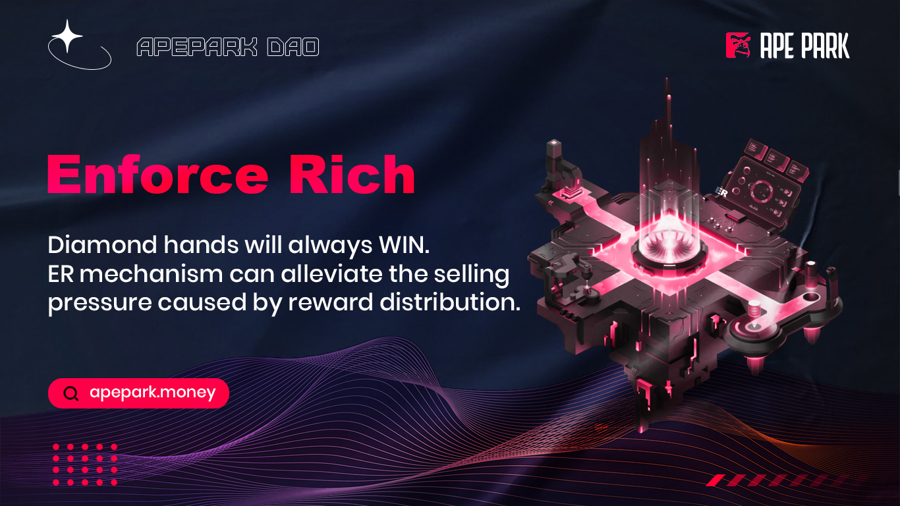

# ⚜ ER(Enforce Rich)

## 什么**是Enforce Rich？**

Enforce Rich直译为强制暴富机制。ApeParkDAO通过ER机制抑制在高折扣购买Bargain的同时获得高额推荐奖励造成的双重抛压隐患。

假设用户通过推荐获得了推荐奖励100枚APD；该用户需要购买与推荐奖励数额相等的Bargain（案例为100APD）才可以激活ER机制。这个奖励分14天释放，Bargain也是14天释放，14天后您将获得200APD。
