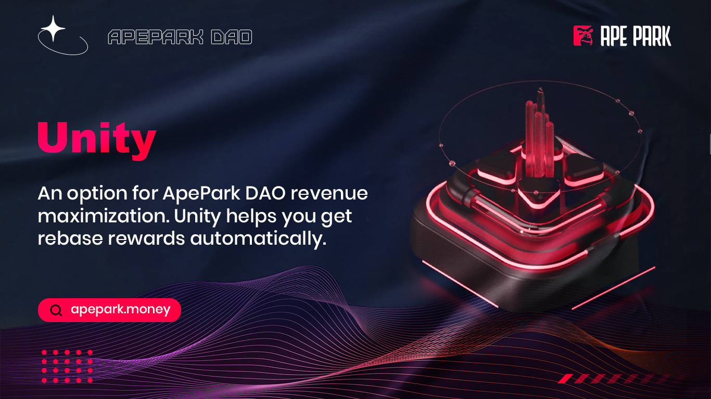

# 🔒 Unity

## 什么**是Unity？**

Unity是ApePark DAO收益最大化的选择。Unity用户于ApePark DAO页面Unity他们的APD以获得奖励。奖励(rebase reward)来自于Bargain销售的进行发放，且根据协议里uAPD(Unity APD)的数量而改变。

Unity是一个被动且可长期使用的策略。您的uAPD数量将逐渐增加而相对的您的成本基础将会持续下降。换句话说，即使市场价格下跌至低于您买进的价格，当大多数的用户将买入的APD进行Unity时，而Unity一段够长的时间，您的uAPD余额增长的速度终将胜过价格下跌速度。

当您Unity时，将锁定您的APD并获得相同数量的uAPD。您的uAPD帐户余额将会在每个周期(epoch)自动获得奖励，uAPD是可以被转移的至其他钱包。

当您取消Unity，您将销毁uAPD并获得相同数量的APD，取消Unity代表使用者将丧失获取奖励的资格。必须注意到，可获得的奖励数量只会取决于Unity的数量；(如果还有)剩下的uAPD将会继续获取奖励。

取消Unity需要6个epochs，这被称为归属期。归属期满后，Unity用户可以全额索取APD。
