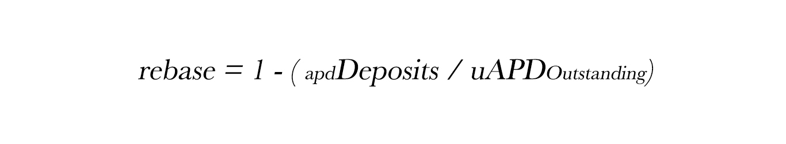
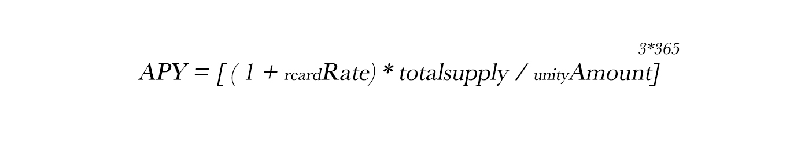

# 公式

## Unity

APD和uAPD之间的交换始终以 1:1 兑换。

储备金在存入利润时不会要求返还uAPD，这样会造成不平衡。 rebase是为了纠正 APD和uAPD的未偿余额之间的不平衡。此变基确保uAPD等于APD。

展示年化回报率。它考虑了复利的影响，因为uAPD会以指数方式变基。

.jpg>)

衡量ApeParkDAO协议中所有APD的美元价值。

## Bargain

Bargain价格由SLP的价值和未偿Bargain的数量决定。协议认为APD和$USDT是相等的，因为该协议通过其内在价值来衡量APD。这意味着我们只需要关心池中资产的总和，而不是它们的价值。根据常数乘积公式x\*y = k，无风险值是x + y的最小值。 这恰好是当 x = y时。 我们可以使用x和y的平方根来确定这一点。

Bargain比率是所有已承诺的APD Bargain的总和除以APD的总供应量。这使我们能够衡量系统的债务。

溢价来源于系统的负债率和比率变量。 这个缩放变量使我们能够控制Bargain价格的上涨速度。 溢价决定了协议的收益，进而决定了Bargain参与者的权益。 以溢价收集的LP用于打造新的APD并将其分配给Bargain参与者和DAO。

## 销售

如果最后市价大于 TWAP，销售合约将以最后市价减去 DAO 控制的折扣执行订单，从而提供套利以鼓励流动性。

## 仪表盘

每个APD的支持

流通中的每一个APD都有Cave的支持。Cave中的资产可以分为两类：稳定币和非稳定币。

如何计算协议的流动性：

